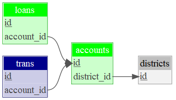

```{r setup, include=FALSE}
knitr::opts_chunk$set(echo = TRUE)

library(dm)

library(RMariaDB)

library(DiagrammeR)

library(DiagrammeRsvg)

library(htmltools)

library(webshot)

fin_db <- dbConnect(
  MariaDB(),
  username = 'guest',
  password = 'relational',
  dbname = 'Financial_ijs',
  host = 'relational.fit.cvut.cz'
)

fin_dm <- dm_from_src(fin_db)

fin_dm_small <- fin_dm[c("loans", "accounts", "districts", "trans")]

fin_dm_small <-
  fin_dm %>%
  dm_select_tbl(loans, accounts, districts, trans)

fin_dm_keys <-
  fin_dm_small %>%
  dm_add_pk(accounts, id) %>%
  dm_add_pk(loans, id) %>%
  dm_add_fk(loans, account_id, accounts) %>%
  dm_add_pk(trans, id) %>%
  dm_add_fk(trans, account_id, accounts) %>%
  dm_add_pk(districts, id) %>%
  dm_add_fk(accounts, district_id, districts)
```

```{r image, echo=FALSE}
fin_dm_keys %>%
  dm_set_colors(green = c(loans, accounts), darkblue = trans, grey = districts) %>%
  dm_draw() %>%
  export_svg() %>%
  HTML() %>% 
  save_html(., "test.html", background = "white", libdir = "lib", lang = "en")

webshot(
    url  = "test.html", 
    file = "test.png",
    selector = "svg" # you can specify any css tag
)

#
```